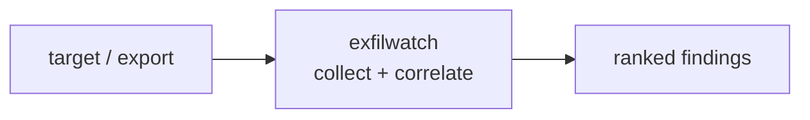

<a name="top"></a>
<div align="center">


# EXFILWATCH

### Detect DNS/HTTP exfiltration patterns (entropy, beaconing) in logs


[](https://pypi.org/project/cognis-exfilwatch/) [](https://github.com/cognis-digital/exfilwatch/actions) [](LICENSE) [](https://github.com/cognis-digital)

*Part of the Cognis Neural Suite.*

</div>

```bash
pip install cognis-exfilwatch
exfilwatch scan .            # → prioritized findings in seconds
```


<!-- cognis:example:start -->
## 🔎 Example output

Real, reproducible output from the tool — runs offline:

```console
$ exfilwatch-emit --version
exfilwatch 0.1.0
```

```console
$ exfilwatch-emit --help
usage: exfilwatch [-h] [--version] {scan,feeds} ...

Detect DNS/HTTP exfiltration patterns (entropy, beaconing, tunneling) in logs.

positional arguments:
  {scan,feeds}
    scan        Analyze a JSONL log file (or '-' for stdin).
    feeds       List / update / fetch the threat-intel feeds exfilwatch
                consumes.

options:
  -h, --help    show this help message and exit
  --version     show program's version number and exit
```

> Blocks above are real `exfilwatch` output — reproduce them from a clone.

**Sample result format** _(illustrative values — run on your own data for real findings):_

```
{
"timestamp": "2023-02-16T14:30:00Z",
"platforms": [
    {
        "name": "STIX",
        "data": {
            "indicator": {
                "type": "url",
                "value": "https://example.com/indicator"
            },
            "observables": [
                {
                    "type": "domain-name",
                    "value": "example.com"
                }
            ]
        }
    }
]
}
```

<!-- cognis:example:end -->

## Usage — step by step

1. **Install** the CLI:

   ```bash
   pipx install "git+https://github.com/cognis-digital/exfilwatch.git"
   ```

2. **Scan** a newline-delimited JSON (JSONL) log for exfiltration signals — the primary command. Pass a path or `-` for stdin:

   ```bash
   exfilwatch scan netflow.jsonl
   cat netflow.jsonl | exfilwatch scan -
   ```

3. **Tune detectors** — DNS-tunneling entropy, beaconing regularity, and oversized-DNS length:

   ```bash
   exfilwatch scan netflow.jsonl \
     --entropy-threshold 3.8 --beacon-min-events 6 --beacon-max-jitter 0.1 --dns-max-len 48
   ```

4. **Read the output** — a table by default, JSON for SIEM ingestion, or SARIF for code-scanning/CI:

   ```bash
   exfilwatch scan netflow.jsonl --format json  > alerts.json
   exfilwatch scan netflow.jsonl --format sarif > exfilwatch.sarif   # upload to GitHub code scanning
   ```

5. **Automate in a pipeline** — pull beaconing alerts from JSON:

   ```bash
   exfilwatch scan netflow.jsonl --format json | jq '.[] | select(.kind=="beacon")'
   ```

## Contents

- [Why exfilwatch?](#why) · [Features](#features) · [Quick start](#quick-start) · [Example](#example) · [Demos](#demos) · [Architecture](#architecture) · [AI stack](#ai-stack) · [How it compares](#how-it-compares) · [Integrations](#integrations) · [Install anywhere](#install-anywhere) · [Related](#related) · [Contributing](#contributing)

<a name="why"></a>
## Why exfilwatch?

catch beacons

`exfilwatch` is single-purpose, scriptable, and self-hostable: point it at a target, get prioritized results in the format your workflow already speaks (table · JSON · SARIF), gate CI on it, and let agents drive it over MCP.

<div align="right"><a href="#top">↑ back to top</a></div>

<a name="features"></a>
## Features

- ✅ Shannon Entropy
- ✅ Parse Log
- ✅ Detect Entropy
- ✅ Detect Beaconing
- ✅ Detect Long Dns
- ✅ Analyze
- ✅ Output as table · JSON · **SARIF 2.1.0** (GitHub code-scanning ready)
- ✅ Reads epoch **and** ISO-8601 timestamps; path or stdin (`-`)
- ✅ 10 ready-to-run [demo scenarios](#demos) (real JSONL, verified in CI)
- ✅ Runs on Linux/macOS/Windows · Docker · devcontainer
- ✅ Ports in Python, JavaScript, Go, and Rust (`ports/`)

<div align="right"><a href="#top">↑ back to top</a></div>

<a name="quick-start"></a>
## Quick start

```bash
pip install cognis-exfilwatch
exfilwatch --version
exfilwatch scan .                       # scan current project
exfilwatch scan . --format json         # machine-readable
exfilwatch scan . --fail-on high        # CI gate (non-zero exit)
```

<div align="right"><a href="#top">↑ back to top</a></div>

<a name="example"></a>
## Example

```text
$ exfilwatch scan .
  [HIGH    ] EXF-001  example finding             (./src/app.py)
  [MEDIUM  ] EXF-002  another signal              (./config.yaml)

  2 findings · risk score 5 · 38ms
```

<div align="right"><a href="#top">↑ back to top</a></div>

<a name="demos"></a>
## Demos

Ten self-contained scenarios live in [`demos/`](demos/). Each is a real JSONL
log plus a `SCENARIO.md` narrative (where the data came from, the exact command,
and how to act). Every demo's documented outcome is asserted in the test suite,
so they never rot. Run any of them straight from a clone:

| # | Scenario | What it shows | Fires? |
|---|---|---|:---:|
| [01](demos/01-basic/) | Basic triage | tunnel + beacon + benign noise | ✅ |
| [02](demos/02-clean/) | Clean baseline | known-good traffic → silent | — clean |
| [03](demos/03-mixed/) | Beacon in noise | one C2 buried in browsing | ✅ |
| [04](demos/04-dns-tunnel-bulk/) | DNS tunnel | sustained base32 exfil (entropy + long_dns) | ✅ |
| [05](demos/05-http-beacon-jitter/) | C2 heartbeat | 10-min beacon with jitter | ✅ |
| [06](demos/06-iso8601-timestamps/) | SIEM export | ISO-8601 timestamps parse fine | ✅ |
| [07](demos/07-http-path-exfil/) | HTTP path exfil | base64 blobs in URL paths | ✅ |
| [08](demos/08-multi-host-fanout/) | Botnet fan-out | 4 hosts → one shared C2 | ✅ |
| [09](demos/09-stdin-pipe/) | Streaming | scan from stdin (`scan -`) | ✅ |
| [10](demos/10-tuning-fp/) | Threshold tuning | legit CDN; avoiding false positives | — clean |
| [11](demos/11-c2-attribution/) | C2 attribution | `--enrich` matches dst to Feodo/ThreatFox | ✅ |

```bash
python -m exfilwatch scan demos/04-dns-tunnel-bulk/events.jsonl
cat demos/09-stdin-pipe/events.jsonl | python -m exfilwatch scan - --format json
```

<div align="right"><a href="#top">↑ back to top</a></div>

<a name="threat-intel"></a>
## Threat-intel enrichment (real feeds, edge / air-gap deployable)

Behavioural detection tells you a host is beaconing or tunnelling. **Enrichment
tells you *who*.** With `--enrich`, exfilwatch cross-references every finding's
destination against two real, keyless [abuse.ch](https://abuse.ch) feeds and
attaches the known C2 / malware family to the finding — bumping confirmed C2 to
**high** severity:

| Feed id | Source | What it gives |
|---|---|---|
| `feodo-c2` | [Feodo Tracker IP blocklist](https://feodotracker.abuse.ch/downloads/ipblocklist.json) | Active botnet C2 IPs (Emotet / Dridex / …) |
| `threatfox` | [ThreatFox recent IOCs](https://threatfox.abuse.ch/export/json/recent/) | Recent IP / domain IOCs + malware family + confidence |

```bash
# Manage the feeds (restricted to what exfilwatch consumes)
exfilwatch feeds list                       # show consumed feeds + cache age
exfilwatch feeds update feodo-c2 threatfox  # fetch + cache (online)
exfilwatch feeds get threatfox --offline    # print from cache, no network

# Scan with attribution
exfilwatch scan netflow.jsonl --enrich               # refresh feeds, then attribute
exfilwatch scan netflow.jsonl --enrich --offline     # cache-only (air-gap)
```

Example (from [demo 11](demos/11-c2-attribution/)):

```
high  beaconing  0.990  10.0.0.5 -> 185.244.25.231         ... | KNOWN C2: Emotet (feodo-c2)
high  entropy    0.990  10.0.0.7 -> evil-exfil.example.com ... | KNOWN C2: Cobalt Strike (threatfox)

Threat-intel attribution (abuse.ch Feodo C2 / ThreatFox):
  185.244.25.231         -> Emotet        [feodo-c2, conf 100]
  evil-exfil.example.com -> Cobalt Strike [threatfox, conf 90]
```

The matched indicators are also attached to each finding's `evidence.intel` in
`--format json`/`sarif` output, and surfaced as a top-level `intel_matches` map.

### Edge / air-gap (offline) operation

The bundled `datafeeds` module (stdlib only — no pip deps) fetches each feed
over HTTPS, caches it to disk, and **re-serves it offline** so the tool keeps
working on disconnected / tactical gear:

- Cache location: `COGNIS_FEEDS_CACHE` (default `~/.cache/cognis-feeds`).
- `--offline` (and `get --offline`) serve only the on-disk cache and never touch
  the network. If a feed is not cached, you are told to run `feeds update`.

**Sneakernet a snapshot into an enclave:**

```bash
# On a connected staging host:
exfilwatch feeds update feodo-c2 threatfox
python -m exfilwatch.datafeeds snapshot-export feeds.tar.gz

# Carry feeds.tar.gz across the air gap, then on the isolated host:
export COGNIS_FEEDS_CACHE=/opt/cognis-feeds
python -m exfilwatch.datafeeds snapshot-import feeds.tar.gz
exfilwatch scan netflow.jsonl --enrich --offline
```

The test suite runs this enrichment **fully offline** against trimmed feed
fixtures committed under [`tests/fixtures/feeds-cache/`](tests/fixtures/feeds-cache/) —
no test ever hits the network.

> Defensive / authorized-use intelligence only.

<div align="right"><a href="#top">↑ back to top</a></div>

<a name="passive-vs-active"></a>
## Passive (default) vs. Active mode

EXFILWATCH is a **defensive** tool. It runs in two modes:

### Passive mode — the safe default (offline, no network)

`exfilwatch scan` analyses logs/exports you already have, **entirely offline**.
It never connects to any destination it sees in the data. Passive detection
covers high-entropy DNS labels / HTTP path segments, periodic beaconing, and
oversized DNS names, with optional offline threat-intel attribution
(`--enrich --offline`). This is what you should use in almost every case, and
it is the only mode that runs without extra flags.

### Active mode — AUTHORIZED USE ONLY (off by default)

> ⚠️ **AUTHORIZED USE ONLY.** Active mode makes live network connections to the
> destinations flagged by a passive scan. Only run it against infrastructure you
> **own** or have **written permission** to assess. Actively probing third-party
> systems may be illegal. EXFILWATCH sends **no payload** — it performs a single
> TCP connect to confirm reachability (the equivalent of `nc -z`), optionally
> reading a banner the peer volunteers. There are no exploits, fuzzing, or C2.

Active mode is gated behind **three** hard requirements — all are mandatory:

| Gate | Flag | Behaviour if missing |
|---|---|---|
| Explicit opt-in | `--active` | mode stays off (passive) |
| Asserted authorization | `--authorized` | refuses, exits non-zero |
| Non-empty scope allowlist | `--target-allowlist host,ip,CIDR` | refuses, exits non-zero |
| Rate limit (default 1/s) | `--rate-limit PPS` | default applied |

Targets are derived from passive findings; any target **not matching the
allowlist is skipped and never contacted**. A loud authorized-use banner is
printed to stderr before any probe.

```bash
# Confirm reachability of flagged C2 on infra you are authorized to assess:
exfilwatch scan netflow.jsonl \
    --active --authorized \
    --target-allowlist 10.20.0.0/16,c2-staging.internal \
    --rate-limit 2 --format json
```

Active-mode tests in CI connect **only to a localhost fixture server / mocks** —
never a real external host.

<div align="right"><a href="#top">↑ back to top</a></div>

<a name="ports"></a>
## Language ports

The core DNS-exfil check (Shannon-entropy labels + oversized DNS names) is ported
to **JavaScript, Go, and Rust** under [`ports/`](ports/), each with its own tests
and a shared JSON output shape. The Python package is the reference; the
JavaScript port is verified locally; Go and Rust are built and tested on GitHub
runners (`.github/workflows/ports.yml`). See [`ports/README.md`](ports/README.md).

<div align="right"><a href="#top">↑ back to top</a></div>

<a name="architecture"></a>
## Architecture



<div align="right"><a href="#top">↑ back to top</a></div>

<a name="ai-stack"></a>
## Use it from any AI stack

`exfilwatch` is interoperable with every popular way of using AI:

- **MCP server** — `exfilwatch mcp` (Claude Desktop, Cursor, Cognis.Studio, [uncensored-fleet](https://github.com/cognis-digital/uncensored-fleet))
- **OpenAI-compatible / JSON** — pipe `exfilwatch scan . --format json` into any agent or LLM
- **LangChain · CrewAI · AutoGen · LlamaIndex** — wrap the CLI/JSON as a tool in one line
- **CI / scripts** — exit codes + SARIF for non-AI pipelines

<div align="right"><a href="#top">↑ back to top</a></div>

<a name="how-it-compares"></a>
## How it compares

| | **Cognis exfilwatch** | RITA |
|---|:---:|:---:|
| Self-hostable, no account | ✅ | varies |
| Single command, zero config | ✅ | ⚠️ |
| JSON + SARIF for CI | ✅ | varies |
| MCP-native (AI agents) | ✅ | ❌ |
| Polyglot ports (JS/Go/Rust) | ✅ | ❌ |
| Open license | ✅ COCL | varies |

*Built in the spirit of **RITA**, re-framed the Cognis way. Missing a credit? Open a PR.*

<div align="right"><a href="#top">↑ back to top</a></div>

<a name="integrations"></a>
## Integrations

Pipes into your stack: **SARIF** for code-scanning, **JSON** for anything, an **MCP server** (`exfilwatch mcp`) for AI agents, and a webhook forwarder for SIEM/Slack/Jira. See [`docs/INTEGRATIONS.md`](docs/INTEGRATIONS.md).

<div align="right"><a href="#top">↑ back to top</a></div>

<a name="install-anywhere"></a>
## Install — every way, every platform

```bash
pip install "git+https://github.com/cognis-digital/exfilwatch.git"    # pip (works today)
pipx install "git+https://github.com/cognis-digital/exfilwatch.git"   # isolated CLI
uv tool install "git+https://github.com/cognis-digital/exfilwatch.git" # uv
pip install cognis-exfilwatch                                          # PyPI (when published)
docker run --rm ghcr.io/cognis-digital/exfilwatch:latest --help        # Docker
brew install cognis-digital/tap/exfilwatch                             # Homebrew tap
curl -fsSL https://raw.githubusercontent.com/cognis-digital/exfilwatch/main/install.sh | sh
```

| Linux | macOS | Windows | Docker | Cloud |
|---|---|---|---|---|
| `scripts/setup-linux.sh` | `scripts/setup-macos.sh` | `scripts/setup-windows.ps1` | `docker run ghcr.io/cognis-digital/exfilwatch` | [DEPLOY.md](docs/DEPLOY.md) (AWS/Azure/GCP/k8s) |

<div align="right"><a href="#top">↑ back to top</a></div>

<a name="related"></a>
## Related Cognis tools

- [`portfan`](https://github.com/cognis-digital/portfan) — Summarize and diff nmap XML into prioritized, attackable findings
- [`subhunt`](https://github.com/cognis-digital/subhunt) — Aggregate & dedupe subdomain enumeration from multiple sources
- [`dirsight`](https://github.com/cognis-digital/dirsight) — Analyze web content-discovery output (ffuf/gobuster) into ranked endpoints
- [`jwtinspect`](https://github.com/cognis-digital/jwtinspect) — Decode JWTs and lint for alg=none, weak secrets, and missing claims
- [`corsaudit`](https://github.com/cognis-digital/corsaudit) — Detect permissive/misconfigured CORS from headers or a config
- [`headerscan`](https://github.com/cognis-digital/headerscan) — Grade HTTP security headers (CSP/HSTS/XFO) A-F from a response dump

**Explore the suite →** [🗂️ all 170+ tools](https://github.com/cognis-digital/cognis-neural-suite) · [⭐ awesome-cognis](https://github.com/cognis-digital/awesome-cognis) · [🔗 cognis-sources](https://github.com/cognis-digital/cognis-sources) · [🤖 uncensored-fleet](https://github.com/cognis-digital/uncensored-fleet) · [🧠 engram](https://github.com/cognis-digital/engram)

<div align="right"><a href="#top">↑ back to top</a></div>

<a name="contributing"></a>
## Contributing

PRs, new rules, and demo scenarios are welcome under the collaboration-pull model — see [CONTRIBUTING.md](CONTRIBUTING.md) and [SECURITY.md](SECURITY.md).

> ### ⭐ If `exfilwatch` saved you time, **star it** — it genuinely helps others find it.

## Interoperability

`{}` composes with the 300+ tool Cognis suite — JSON in/out and a shared
OpenAI-compatible `/v1` backbone. See **[INTEROP.md](INTEROP.md)** for the
suite map, composition patterns, and reference stacks.

## License

Source-available under the **Cognis Open Collaboration License (COCL) v1.0** — free for personal, internal-evaluation, research, and educational use; **commercial / production use requires a license** (licensing@cognis.digital). See [LICENSE](LICENSE).

---

<div align="center"><sub><b><a href="https://cognis.digital">Cognis Digital</a></b> · one of 170+ tools in the <a href="https://github.com/cognis-digital/cognis-neural-suite">Cognis Neural Suite</a> · <i>Making Tomorrow Better Today</i></sub></div>
